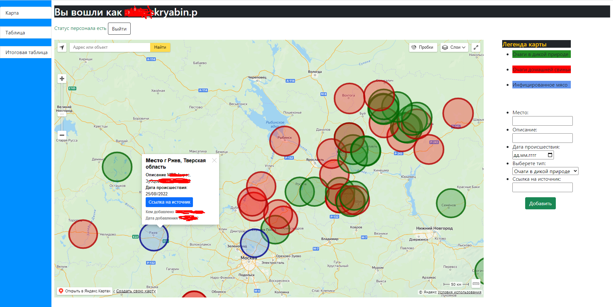
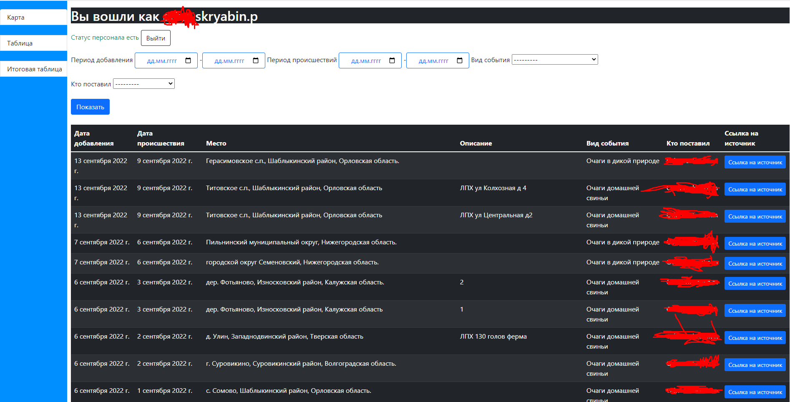
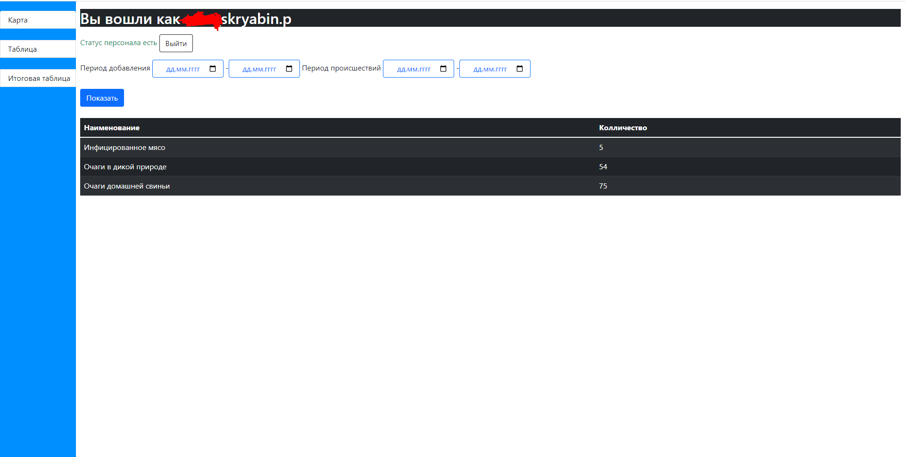

## Tracking African swine fever outbreaks

This website was produced for tracking  and adding points of african swine fever outbreaks
#### It works on Django and Yandex Map API Javascript
 I know JS as good as almost nothing so don't judge me for some shit codding in JS part:D

### There's few main parts :
1. Main page which contains Yandex Map. if user has access he can add
circle(30km radius) by clicking on map choose category of the event and add some description by clicking on map.
 
2. Page contains table of all circles have been added  with filtering
 
3. This page contains resulting sum of the events by category with filtering by date periods
 
